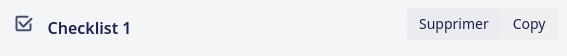
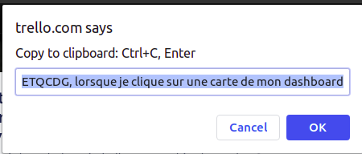

# Chrome extension : Copy a checklist on Trello

## How to install 

- you need to clone the repository
- on chrome://extensions you should activate the `developer mode` and then click on the `Load unpacked` button
- select the repository of the project on your computer

## How to use 

- go to your trello's dashboard 
- open a card
- you should see a button nammed `Copy` on each checklist
 
  
  
- click on the button and you'll see a window that allows you to copy all the checklist into your clipboard
 
  
  
- On this window : Ctrl + C, Enter 
- Paste on another checklist 

